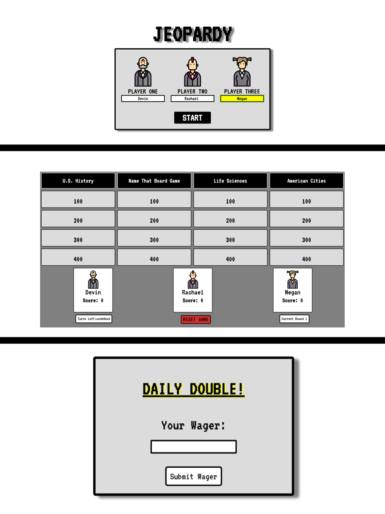
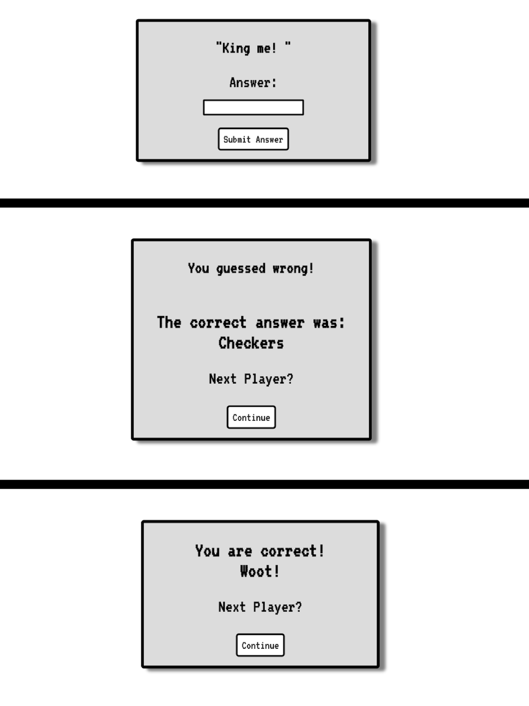

# Jeopardy
### By Devin and Rachael


This was a paired project in which we needed to write a program in OOP style in the theme of Jeopardy.

## What We gained from this project
In making this app we have gained a better understanding of the pros and cons of OOP vs functional programming. It has also given us an opportunity to practice writing our own tests with Mocha and Chai.

## The link to Github sites view:
https://rdren0.github.io/Game-Time-Jeopardy/

### Screenshots
A few examples of screens in the game:

The question screens:



## Dependecies
Once you have cloned the repo, install the library dependencies. Run:
```bash
npm install
```
To verify that it is setup correctly, run `npm start` in your terminal. Go to `http://localhost:8080/` and you should see a page with some `h1` text and a pink background. If that's the case, enter `control + c` in your terminal to stop the server.


## How to View Your Code in Action

In the terminal, run:

```bash
npm start
```

You will see a bunch of lines output to your terminal. One of those lines will be something like:

```bash
Project is running at http://localhost:8080/
```

Go to `http://localhost:8080/` in your browser to view your code running in the browser.


## Webpack?

If you look in the `package.json` file, you'll see one of the library dependencies called `webpack`. If you're interested in learning more about what Webpack is and how it works behind the scenes, take a look through the [Webpack configuration documentation](https://webpack.js.org/concepts/).

## Deploying to GitHub Pages

_If you are finished with the functionality and testing of your game_, then you can consider deploying your game to the web! This way anyone can play it without cloning down your repo.

[GitHub Pages](https://pages.github.com/) is a great way to deploy your game to the web. More information about how to do this on the way...
